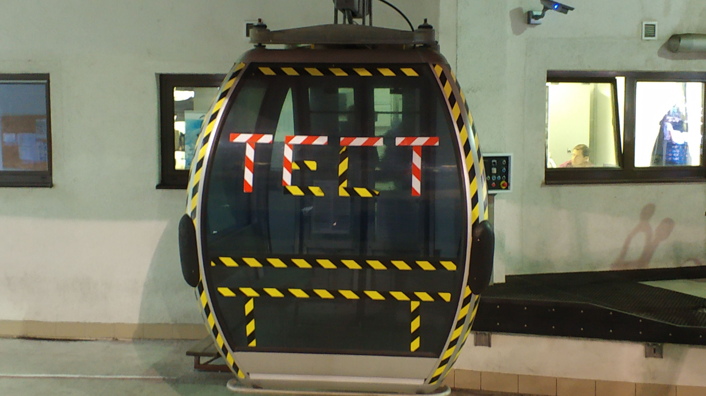

### Moscow Python Beer Meetup №17

**Место**: [We-Pub][0]

**Время**: 2019-10-24T19:00+03:00

Соскучились? И так...Долгожданный. Октябрьский. Бирмитап состоится 24го октября в нашем
традиционном баре, который пережил внезапный рефакторинг. Обсудим зачем нужно
обновляться на 3.8 и как сбросить питоняшку с моста, а [Костя][1] нам расскажет давно 
обещанную историю как с помощью datetime.datetime можно положить продакшн.

Как вы могли уже догадаться, в этот раз мы будем что-то тестировать. Возможно вы
слышали, что митап.ком меняет правила работы и хочет собирать деньги со всех кто
отметился на мероприятие. Или с тех, кто устраивает, мы ещё не до конца поняли. 
Началась история с [этого поста][2]

Мы надеемся что это все неправда и можно будет дальше тут публиковать анонсы и
отмечаться и никто никому ничего не будет должен, но в качестве запасного плана
организовали [новую площадку][3] для анонсов и прочей активности. Пока следите за 
репозиторием, мы ещё утрясаем процессы.

Так что приходите, будет о чем похоливарить!

[0]: https://www.google.com/maps/search/?api=1&query=55.764835%2C37.608170
[1]: https://github.com/kostya
[2]: https://twitter.com/hmemcpy/status/1183801821544026112
[3]: https://github.com/moscow-python-beer/we-pub
